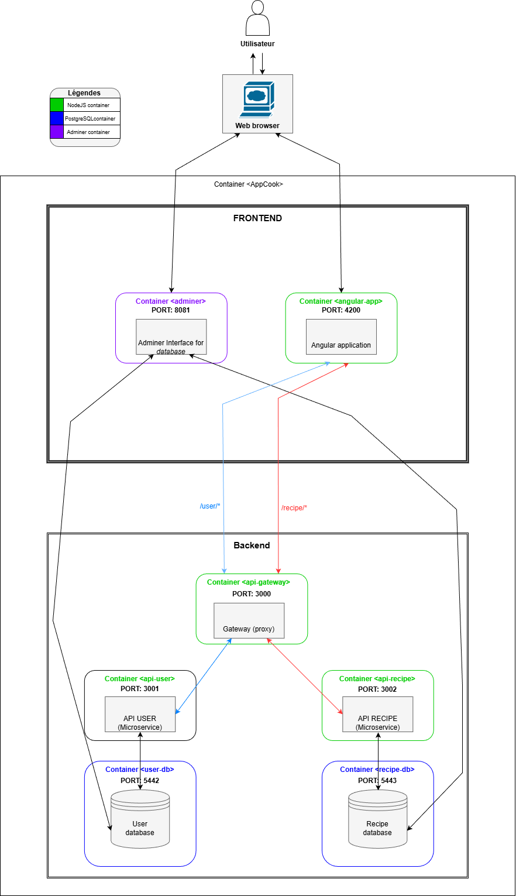
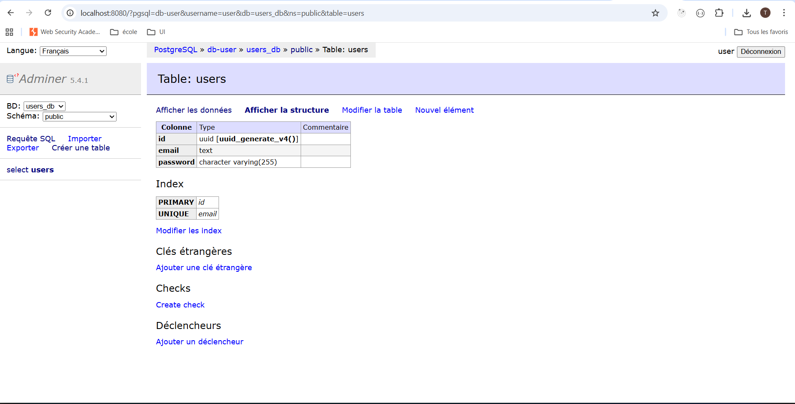

# 🍽️ Ynov Fullstack M1 — Application de recettes de cuisine

Cette application centralise l’ensemble des fonctionnalités utiles en cuisine : gestion de recettes, planification des repas, suivi intelligent des ingrédients du frigo, génération optimisée de listes de courses et suggestions personnalisées.  
Grâce à ses outils avancés (analyse nutritionnelle, alertes de péremption, menus équilibrés…), elle offre une solution complète et intuitive pour faciliter la préparation des repas et mieux organiser son quotidien culinaire.

---

## 📑 Table des matières

- [✨ Fonctionnalités](#-fonctionnalités)
  - [🍽️ Gestion des recettes](#-gestion-des-recettes)
  - [🧊 Gestion du frigo & ingrédients](#-gestion-du-frigo--ingrédients)
  - [🤖 Systèmes intelligents & automatisations](#-systèmes-intelligents--automatisations)
  - [🗂️ Organisation des repas & courses](#-organisation-des-repas--courses)
  - [🔍 Recherche et navigation](#-recherche-et-navigation)
  - [🔐 Gestion utilisateur & expérience](#-gestion-utilisateur--expérience)
- [🛠️ Stack technique & choix technologiques](#-stack-technique--choix-technologiques)
- [🏛️ Architecture et répartition des services](#architecture-et-répartition-des-services)

---

## ✨ Fonctionnalitées:

### 🍽️ Gestion des recettes

- **CRUD complet des recettes** : création, lecture, modification et suppression
- **Téléversement de médias** : ajout d’images et de vidéos pour illustrer les recettes
- **Système de favoris** : sauvegarde des recettes préférées
- **Tags personnalisés** : catégories personnalisées pour faciliter le tri (“pique-nique”, “rapide”, “batch cooking”…)
- **Filtre par allergènes** : exclusion des recettes contenant certains ingrédients
- **Minuteur intégré** : timer disponible pour chaque étape ou temps de cuisson

### 🧊 Gestion du frigo & ingrédients

- **Gestion du frigo avancée** : ajout des aliments avec quantité et date d’expiration
- **Alertes de péremption** : notifications lorsque les ingrédients approchent de la date limite
- **Scan de code-barres** : ajout automatique d’un ingrédient au frigo

### 🤖 Systèmes intelligents & automatisations

- **Suggestions automatiques** : recommandations de recettes basées sur les ingrédients disponibles
- **Analyse nutritionnelle automatique** _(API Edamam)_ : calories, macros et valeurs nutritionnelles calculées automatiquement
- **Suggestion de menus équilibrés** : menus hebdomadaires thématisés (“healthy”, “économique”, “rapide”…)

### 🗂️ Organisation des repas & courses

- **Liste des repas de la semaine** : planification hebdomadaire avec sélection des recettes
- **Liste de courses** : génération automatique des ingrédients nécessaires
- **Optimisation de la liste de courses** : regroupement par catégories (boucherie, légumes…) et calcul automatique des quantités

### 🔍 Recherche et navigation

- **Recherche avancée** : filtrage par ingrédients, temps de préparation et mots-clés

### 🔐 Gestion utilisateur & expérience

- **Authentification** : inscription, connexion, sécurisation des routes
- **Mode hors-ligne (PWA)** : accès aux recettes favorites sans connexion
- **Interface responsive** : utilisable sur mobile, tablette et desktop

---

## 🛠️ Stack technique & choix technologiques

### 🔷 **Frontend : Angular**

J’ai choisi **Angular** pour plusieurs raisons :

- **Structure robuste et opinionnée**, idéale pour garder un code propre sur un projet complet.
- Utilisation native de **TypeScript**, ce qui augmente la fiabilité et la maintenabilité.
- **Reactive Forms**, très utile pour l’ajout/édition des recettes avec la sécurité apporté par les validators.
- **Écosystème complet** : routing, guards, animations, CLI puissante…

### 💎 **ORM: Prisma**

- **Ergonomie TypeScript** génération automatique de types pour les modèles et sécurité au moment de la compilation.
- **Générations** automatiques de types.
- **Migration intégrées**:facilite la gestion des schémas et des versions de la BDD (Prisma migrate).
- **Productivité**: requêtes lisibles, bonnes performances pour les usages CRUD et jointures typiques (recipes ↔ ingredients).

### 🐘 **Base de données : PostgreSQL**

- Base **relationnelle robuste**, adaptée aux entités interdépendantes (recettes, ingrédients, utilisateurs).
- Support des **transactions**, important pour garantir la cohérence lors de mises à jour multiples.
- Très bonnes **performances** sur les requêtes de filtrage et matching d’ingrédients.
- Support de **types avancés** (JSONB, arrays) pour les données semi-structurées.

### 🔐 **Authentification : JWT**

- Fonctionnement **stateless**, parfait pour les APIs REST modernes.
- Compatible avec les **SPA** comme Angular (stockage en mémoire ou cookies HttpOnly).
- Possibilité d’utiliser un **refresh token** côté serveur pour renforcer la sécurité.

### 📁 **Gestion des médias : Multer + stockage local ou cloud**

- **Multer** permet de gérer facilement l’upload et la validation des fichiers.
- Stockage flexible : en local pour le développement, ou sur un cloud (S3, Cloudinary…) en production.

### 📝 **Logs : morgan**

- Middleware simple pour **logger toutes les requêtes HTTP**.
- Très utile pour analyser les comportements, déboguer et surveiller la performance de l’API.

---

## 🏛️ Architecture et répartition des services

### Architecture — vue d'ensemble

L'application est organisée selon une architecture **« Gateway + microservices légers »** avec un frontend Angular. L'objectif est de **séparer clairement les responsabilités** :

- La **Gateway** centralise l'accès, la sécurité et le routage.
- Les **services spécialisés** (api-user, api-recipe, éventuellement media-service) gèrent la logique métier.
- **PostgreSQL** conserve les données relationnelles.

#### Flux principal

1. Le client (Angular) fait toutes les requêtes vers l'API Gateway.

2. La Gateway:

   - Vérifie l'authentification et effectue une validation de base.
   - Applique les règles **CORS** et **rate-limit**.
   - Proxifie les requêtes vers les services adaptés (`/user → api-user`, `/recipe → api-recipe`).

3. Les services communiquent avec **PostgreSQL** pour lire ou écrire les données.

4. Les fichiers médias sont soit stockés :
   - Sur un volume Docker en développement.
   - Sur un service **S3** en production.

---

### Rôle détaillé de chaque bloc

#### 🔷 Frontend (Angular)

- **Responsabilités :**

  - Interface utilisateur, formulaires de création/modification de recettes.
  - Recherche et filtrage de recettes.
  - Affichage des médias (images, vidéos).
  - Gestion des états (favoris, contenu du frigo, etc.).

- **Interactions :**

  - Toutes les requêtes passent par la Gateway.

- **Sécurité :**
  - Stocke le **JWT court terme** en mémoire.
  - Ou utilise un **cookie HttpOnly** pour le refresh token.

---

#### 🛡️ API Gateway (Express + http-proxy-middleware)

- **Responsabilités :**
  - Point d’entrée unique pour le frontend.
  - Centralisation de :
    - **CORS**
    - **Logging** (morgan)
    - **Rate-limiting**
    - Mise en cache éventuelle
  - Vérification et validation du **JWT** avant transfert des requêtes.
  - Routage / proxy vers les services appropriés.
- **Avantages :**
  - Simplifie la gestion des politiques transverses (authentification, quotas, logs).
  - Unifie les coordonnées des services pour le frontend.

---

#### 👤 api-user (Express)

- **Responsabilités :**
  - Inscription, connexion et gestion des **refresh tokens** (stockés hachés).
  - Endpoints pour le profil utilisateur.
  - Sécurité et validation (hash des mots de passe).
- **Données :**
  - Table `users`.
- **Contrat minimal :**
  - `POST /user/register`
  - `POST /user/login`
  - `POST /user/token/refresh`

---

#### 🥘 api-recipe (Express)

- **Responsabilités :**
  - CRUD des recettes (titre, étapes, temps, tags, difficulté, etc.).
  - Gestion des ingrédients et de la relation **many-to-many** (`recipe_ingredients`).
  - Fonctionnalités métier :
    - Matching frigo → suggestions
    - Filtres (temps, tags)
    - Pagination
  - Validation et recherche optimisée
- **Données :**
  - Tables : `recipes`, `ingredients`, `recipe_ingredients`
- **Contrat minimal :**
  - `GET /recipe`
  - `POST /recipe` (auth)
  - `GET /recipe/:id`

---

#### 🐘 PostgreSQL

- **Responsabilités :**
  - Stockage relationnel principal.
  - Gestion des transactions atomiques et relations (recettes ↔ ingrédients).
- **Optimisation :**
  - Indexation pour la performance sur les recherches :
    - `title`
    - `tags`
    - Recherche **full-text**

---

## 📎Annexes:

### 🧾 Création de la table `users` dans PostgreSQL

La table **users** a été créée directement depuis **Adminer**.  
Les captures ci-dessous confirment sa présence ainsi que sa structure dans la base de données.

#### 📌 Requête de création / aperçu de la table

#### 📌 Structure de la table dans Adminer

Ces éléments prouvent que la table est correctement enregistrée dans la base PostgreSQL et accessible par les services backend.

### Lancer l'application

docker network create app-network

docker-compose up --build