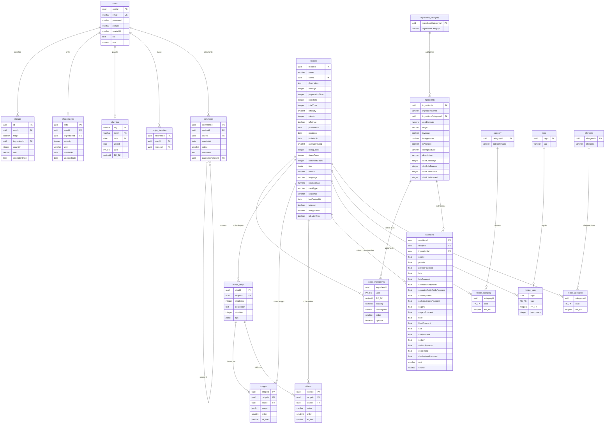

# 🍽️ Ynov Fullstack M1 — Application de recettes de cuisine


Cette application centralise l’ensemble des fonctionnalités utiles en cuisine : gestion de recettes, planification des repas, suivi intelligent des ingrédients du frigo, génération optimisée de listes de courses et suggestions personnalisées.  
Grâce à ses outils avancés (analyse nutritionnelle, alertes de péremption, menus équilibrés…), elle offre une solution complète et intuitive pour faciliter la préparation des repas et mieux organiser son quotidien culinaire.

---


## 📑 Table des matières

- [✨ Fonctionnalités](#-fonctionnalités)
  - [🍽️ Gestion des recettes](#-gestion-des-recettes)
  - [🧊 Gestion du frigo & ingrédients](#-gestion-du-frigo--ingrédients)
  - [🤖 Systèmes intelligents & automatisations](#-systèmes-intelligents--automatisations)
  - [🗂️ Organisation des repas & courses](#-organisation-des-repas--courses)
  - [🔍 Recherche et navigation](#-recherche-et-navigation)
  - [🔐 Gestion utilisateur & expérience](#-gestion-utilisateur--expérience)
- [🛠️ Stack technique & choix technologiques](#-stack-technique--choix-technologiques)
- [🏛️ Architecture et répartition des services](#architecture-et-répartition-des-services)
- [📎 Annexes](#annexes)
  - [🧾 Création de la table users dans PostgreSQL](#création-de-la-table-users-dans-postgresql)
  - [📌 Structure de la table dans Adminer](#structure-de-la-table-dans-adminer)
- [🚀 Lancer l'application](#lancer-lapplication)

---

## ✨ Fonctionnalitées:

### 🍽️ Gestion des recettes

- **CRUD complet des recettes** : création, lecture, modification et suppression
- **Téléversement de médias** : ajout d’images et de vidéos pour illustrer les recettes
- **Système de favoris** : sauvegarde des recettes préférées
- **Tags personnalisés** : catégories personnalisées pour faciliter le tri (“pique-nique”, “rapide”, “batch cooking”…)
- **Filtre par allergènes** : exclusion des recettes contenant certains ingrédients
- **Minuteur intégré** : timer disponible pour chaque étape ou temps de cuisson

### 🧊 Gestion du frigo & ingrédients

- **Gestion du frigo avancée** : ajout des aliments avec quantité et date d’expiration
- **Alertes de péremption** : notifications lorsque les ingrédients approchent de la date limite
- **Scan de code-barres** : ajout automatique d’un ingrédient au frigo

### 🤖 Systèmes intelligents & automatisations

- **Suggestions automatiques** : recommandations de recettes basées sur les ingrédients disponibles
- **Analyse nutritionnelle automatique** _(API Edamam)_ : calories, macros et valeurs nutritionnelles calculées automatiquement
- **Suggestion de menus équilibrés** : menus hebdomadaires thématisés (“healthy”, “économique”, “rapide”…)

### 🗂️ Organisation des repas & courses

- **Liste des repas de la semaine** : planification hebdomadaire avec sélection des recettes
- **Liste de courses** : génération automatique des ingrédients nécessaires
- **Optimisation de la liste de courses** : regroupement par catégories (boucherie, légumes…) et calcul automatique des quantités

### 🔍 Recherche et navigation

- **Recherche avancée** : filtrage par ingrédients, temps de préparation et mots-clés

### 🔐 Gestion utilisateur & expérience

- **Authentification** : inscription, connexion, sécurisation des routes
- **Mode hors-ligne (PWA)** : accès aux recettes favorites sans connexion
- **Interface responsive** : utilisable sur mobile, tablette et desktop

---

## 🛠️ Stack technique & choix technologiques

### 🔷 **Frontend : Angular**

J’ai choisi **Angular** pour plusieurs raisons :

- **Structure robuste et opinionnée**, idéale pour garder un code propre sur un projet complet.
- Utilisation native de **TypeScript**, ce qui augmente la fiabilité et la maintenabilité.
- **Reactive Forms**, très utile pour l’ajout/édition des recettes avec la sécurité apporté par les validators.
- **Écosystème complet** : routing, guards, animations, CLI puissante…

### 💎 **ORM: Prisma**

- **Ergonomie TypeScript** génération automatique de types pour les modèles et sécurité au moment de la compilation.
- **Génération automatique de types à partir du schéma de la base** : Prisma garantit une sécurité de type totale et réduit considérablement les risques d’erreurs de mapping. Cette approche, bien plus stricte que celle de la plupart des autres ORMs (comme Sequelize ou TypeORM), permet de bénéficier d’une autocomplétion fiable et d’un refactoring sécurisé dans tout le projet.
- **Migration intégrées**: facilite la gestion des schémas et des versions de la BDD (Prisma migrate).
- **Productivité**: requêtes lisibles, bonnes performances pour les usages CRUD et jointures typiques (recipes ↔ ingredients).

### 🐘 **Base de données : PostgreSQL**

- Base **relationnelle robuste**, adaptée aux entités interdépendantes (recettes, ingrédients, utilisateurs).
- Support des **transactions**, important pour garantir la cohérence lors de mises à jour multiples.
- Très bonnes **performances** sur les requêtes de filtrage et matching d’ingrédients, grâce au support natif des **types avancés** (JSONB, arrays) et de la **recherche full-text**. Cela permet d’implémenter des filtres puissants et des recherches complexes sur les recettes, là où d’autres bases comme MySQL ou SQLite sont plus limitées.

### 🔐 **Authentification : JWT**

- Fonctionnement **stateless**, parfait pour les APIs REST modernes.
- Compatible avec les **SPA** comme Angular (stockage en mémoire ou cookies HttpOnly).
- Possibilité d’utiliser un **refresh token** côté serveur pour renforcer la sécurité.

### 📁 **Gestion des médias : Multer + stockage local ou cloud**

- **Upload de fichiers flexible** : Multer s’intègre parfaitement à Express pour gérer l’upload et la validation des fichiers, avec une flexibilité de stockage (local ou cloud) immédiate, là où d’autres solutions nécessitent souvent plus de configuration ou des services externes.

### 📝 **Logs : morgan**

- Middleware simple pour **logger toutes les requêtes HTTP** de façon simple, lisible et personnalisable, facilitant le debug et la surveillance sans surcharger l’application, contrairement à des solutions plus lourdes comme Winston ou Bunyan pour ce type de besoin.

---

## 🏛️ Architecture et répartition des services

### Architecture — vue d'ensemble

L'application est organisée selon une architecture **« Gateway + microservices légers »** avec un frontend Angular. L'objectif est de **séparer clairement les responsabilités** :

- La **Gateway** centralise l'accès, la sécurité et le routage.
- Les **services spécialisés** (api-user, api-recipe, éventuellement media-service) gèrent la logique métier.
- **PostgreSQL** conserve les données relationnelles.

#### Flux principal

1. Le client (Angular) fait toutes les requêtes vers l'API Gateway.

2. La Gateway:

   - Vérifie l'authentification et effectue une validation de base.
   - Applique les règles **CORS** et **rate-limit**.
   - Proxifie les requêtes vers les services adaptés (`/user → api-user`, `/recipe → api-recipe`).

3. Les services communiquent avec **PostgreSQL** pour lire ou écrire les données.

4. Les fichiers médias sont soit stockés :
   - Sur un volume Docker en développement.
   - Sur un service **S3** en production.


---

### Rôle détaillé de chaque bloc

#### 🔷 Frontend (Angular)

- **Responsabilités :**

  - Interface utilisateur, formulaires de création/modification de recettes.
  - Recherche et filtrage de recettes.
  - Affichage des médias (images, vidéos).
  - Gestion des états (favoris, contenu du frigo, etc.).

- **Interactions :**

  - Toutes les requêtes passent par la Gateway.

- **Sécurité :**
  - Stocke le **JWT court terme** en mémoire.
  - Ou utilise un **cookie HttpOnly** pour le refresh token.

---

#### 🛡️ API Gateway (Express + http-proxy-middleware)

- **Responsabilités :**
  - Point d’entrée unique pour le frontend.
  - Centralisation de :
    - **CORS**
    - **Logging** (morgan)
    - **Rate-limiting**
    - Mise en cache éventuelle
  - Vérification et validation du **JWT** avant transfert des requêtes.
  - Routage / proxy vers les services appropriés.
- **Avantages :**
  - Simplifie la gestion des politiques transverses (authentification, quotas, logs).
  - Unifie les coordonnées des services pour le frontend.

---

#### 👤 api-user (Express)

- **Responsabilités :**
  - Inscription, connexion et gestion des **refresh tokens** (stockés hachés).
  - Endpoints pour le profil utilisateur.
  - Sécurité et validation (hash des mots de passe).
- **Données :**
  - Table `users`.
- **Contrat minimal :**
  - `POST /user/register`
  - `POST /user/login`
  - `POST /user/token/refresh`

---

#### 🥘 api-recipe (Express)

- **Responsabilités :**
  - CRUD des recettes (titre, étapes, temps, tags, difficulté, etc.).
  - Gestion des ingrédients et de la relation **many-to-many** (`recipe_ingredients`).
  - Fonctionnalités métier :
    - Matching frigo → suggestions
    - Filtres (temps, tags)
    - Pagination
  - Validation et recherche optimisée
- **Données :**
  - Tables : `recipes`, `ingredients`, `recipe_ingredients`
- **Contrat minimal :**
  - `GET /recipe`
  - `POST /recipe` (auth)
  - `GET /recipe/:id`

---

#### 🐘 PostgreSQL

- **Responsabilités :**
  - Stockage relationnel principal.
  - Gestion des transactions atomiques et relations (recettes ↔ ingrédients).
- **Optimisation :**
  - Indexation pour la performance sur les recherches :
    - `title`
    - `tags`
    - Recherche **full-text**

---

## 📊 Schéma relationnel des bases de données


<!-- [![](https://mermaid.ink/img/pako:eNq1Ge1O3DjwVaxI1fUkqGj5Xul-7MFSoVaA-Lgfp0rIm8xmfXXinO0sbCkPcG9xP8tz7IvdONl82glL2QO04Pme8XhmbB48XwTgDTyQx4yGkkZfYoJfb96Q317wVTL9PrwakWP8OT87W_wzuiI3V6NL8pYmbDNVIH99hfT800hR5CFfZICUBRn0NCAXnyr4jEp_SiWBiDJObhyYhCp1J2TgwChIA2HD6YxqKm8kr1Aa7jUZMwexFBxy6GPdAaWFpCFYLrCm-XW3TmrwsUCxNCYTyYIQ2jLiUELAINYtLhZrCEGSv1Maa6bntrVpzHQFDagGAvcJk1QzER_j0uXKVCQJ6rzlTGnLIQM8Xc2p_8F4XwL-CoZteJqYX0GHRwmncYyG1J0plAR07kywCChvIDI92UeX7xefbi33JfgsgSayYVtOcDuhMyGZBvsQlJiXRL1U69TpiyjCDbF1LREuTZbEPhu69kpFlHPceGISMA5b522pvSU-oRKBR6VlTo_WVtguR0enF6O8tOUuv7645XLsaNdyw86_mEbwfKCzuAWgfMkSc6Tt44U8Mwy1sjGJhATySnDN6soKAl-Ir26MFpryJqrc2oBNJsxPef1ElxIpx1wGu-4xdSHZrDy9ZQ4l6RgLztRx4p-pBM6sozMwRfqylXyFdXlSHom0noMFcsbgTnXglonbwv6lRDwmmiXK3l0lUumDDcdCFaa03gHiNALJfNSh9EhpFjWCVK9W1_PEgVFA0Q7KW2HiVKG94mszUtV2_AEhjTsQgN2SubEfeaohPpHgKsNVK7DPQqNNuM5DRXBmn4wKeYTOhULOW-dktShiboYsXmM4hpyDDCF2bEs-LwyDGXPlQf-RngKffGYTOGlNCw4CgG8geyjOU61Y0CfjPIEYgu7O9YJdXa091verezgoMDeNIaE86jgA1v0utkRkIS1Og8sdpSGxHTHQlbtiGULDFAdw_5J6HaR5Se6uI80zFWEWOQJvwC9r40sX6_Bccybr-RCX0zTXt8ZNh7EzzDRhG5uBX21soT-TthZz41Tj4IV7YZtcol5mducwPOGCars95uBECg31utQAX2StpN54cvSEauWCddErqk3qQXBCtZ4PfRaoFUi6pPlUjsV0Hhhy1YvstCcNqVRuaKfPbFzf4xqw22vuhHXSi4ClkRvaGYspFh_MWLw6OlCywNns7ouQa4bo6LO3_rId9lTmWsfs77sFoetC0aXG7xdeoKuW7irJq0n_ibuXpqF9tBHYYS1iuo3slbV64yvaAIsSITWNnRtMl2OFrbDEdLhQ4rsdWVX4T8T7Z29pl6PPw-vT87Mrspnf2Mzz05renL5_39wUD-X7zYB88RKh1OIHDkWei7DxOmLIfbl4ctOW7w6ZVFywCXNTWq8AhiNfOenLG3xmQL4oJZdIFzEam4g4IIt_C_I1701-g17bpbkZoPqwmbuOQ6CpmZ59xejnTDXDHVw84XUIT4P3vOp8MDSs1ExwZPGkKVL1si6ns4opBxQ8Dck2C-M8VRo3zLyB9OpZDlaVHgQsnkSvohpPTk2qjHcqqY1DGRPlkGJGluAYsD6onp1oCSiXzylut4HMzQRjkm19LZNLih7Gdsb0acxqumHCP0LcBjoDv-DLcN3kK_pUFdu6bctKu_gRl0Iqwj4BFZ8jrV1jQZF07WNF9eIJCZiCdVeJ07Pr0eWmqRRX5C067EOi0yxzXv_QhqxnOBMPyBEGWgKnebJpaR5-lAksqiFjqvAzwBBhzmLpViXzMcaM8F-w9_LFkymZmQBi6jsauEEyM3HuQkGYDgZsThpFluHFKfmIQb2jc2_DC_Fe7g20TGHDw3tsRM3Sy9opJscUcNjxTJgDmNCUZ6n4iGwJjf8UIio4pUjDqTeYUK5wlb9rLf-bU5IAXi9l9u7kDd5vbR9mQrzBg3fvDTb33---29_Z2tnaOtjaO9g63Nvw5gje3n23c7h9sLuzd7C9t723_7jhfcvUvn-3v_9he-_DAX4j9vBw9_E_1wMSew?type=png)](https://mermaid.live/edit#pako:eNq1Ge1O3DjwVaxI1fUkqGj5Xul-7MFSoVaA-Lgfp0rIm8xmfXXinO0sbCkPcG9xP8tz7IvdONl82glL2QO04Pme8XhmbB48XwTgDTyQx4yGkkZfYoJfb96Q317wVTL9PrwakWP8OT87W_wzuiI3V6NL8pYmbDNVIH99hfT800hR5CFfZICUBRn0NCAXnyr4jEp_SiWBiDJObhyYhCp1J2TgwChIA2HD6YxqKm8kr1Aa7jUZMwexFBxy6GPdAaWFpCFYLrCm-XW3TmrwsUCxNCYTyYIQ2jLiUELAINYtLhZrCEGSv1Maa6bntrVpzHQFDagGAvcJk1QzER_j0uXKVCQJ6rzlTGnLIQM8Xc2p_8F4XwL-CoZteJqYX0GHRwmncYyG1J0plAR07kywCChvIDI92UeX7xefbi33JfgsgSayYVtOcDuhMyGZBvsQlJiXRL1U69TpiyjCDbF1LREuTZbEPhu69kpFlHPceGISMA5b522pvSU-oRKBR6VlTo_WVtguR0enF6O8tOUuv7645XLsaNdyw86_mEbwfKCzuAWgfMkSc6Tt44U8Mwy1sjGJhATySnDN6soKAl-Ir26MFpryJqrc2oBNJsxPef1ElxIpx1wGu-4xdSHZrDy9ZQ4l6RgLztRx4p-pBM6sozMwRfqylXyFdXlSHom0noMFcsbgTnXglonbwv6lRDwmmiXK3l0lUumDDcdCFaa03gHiNALJfNSh9EhpFjWCVK9W1_PEgVFA0Q7KW2HiVKG94mszUtV2_AEhjTsQgN2SubEfeaohPpHgKsNVK7DPQqNNuM5DRXBmn4wKeYTOhULOW-dktShiboYsXmM4hpyDDCF2bEs-LwyDGXPlQf-RngKffGYTOGlNCw4CgG8geyjOU61Y0CfjPIEYgu7O9YJdXa091verezgoMDeNIaE86jgA1v0utkRkIS1Og8sdpSGxHTHQlbtiGULDFAdw_5J6HaR5Se6uI80zFWEWOQJvwC9r40sX6_Bccybr-RCX0zTXt8ZNh7EzzDRhG5uBX21soT-TthZz41Tj4IV7YZtcol5mducwPOGCars95uBECg31utQAX2StpN54cvSEauWCddErqk3qQXBCtZ4PfRaoFUi6pPlUjsV0Hhhy1YvstCcNqVRuaKfPbFzf4xqw22vuhHXSi4ClkRvaGYspFh_MWLw6OlCywNns7ouQa4bo6LO3_rId9lTmWsfs77sFoetC0aXG7xdeoKuW7irJq0n_ibuXpqF9tBHYYS1iuo3slbV64yvaAIsSITWNnRtMl2OFrbDEdLhQ4rsdWVX4T8T7Z29pl6PPw-vT87Mrspnf2Mzz05renL5_39wUD-X7zYB88RKh1OIHDkWei7DxOmLIfbl4ctOW7w6ZVFywCXNTWq8AhiNfOenLG3xmQL4oJZdIFzEam4g4IIt_C_I1701-g17bpbkZoPqwmbuOQ6CpmZ59xejnTDXDHVw84XUIT4P3vOp8MDSs1ExwZPGkKVL1si6ns4opBxQ8Dck2C-M8VRo3zLyB9OpZDlaVHgQsnkSvohpPTk2qjHcqqY1DGRPlkGJGluAYsD6onp1oCSiXzylut4HMzQRjkm19LZNLih7Gdsb0acxqumHCP0LcBjoDv-DLcN3kK_pUFdu6bctKu_gRl0Iqwj4BFZ8jrV1jQZF07WNF9eIJCZiCdVeJ07Pr0eWmqRRX5C067EOi0yxzXv_QhqxnOBMPyBEGWgKnebJpaR5-lAksqiFjqvAzwBBhzmLpViXzMcaM8F-w9_LFkymZmQBi6jsauEEyM3HuQkGYDgZsThpFluHFKfmIQb2jc2_DC_Fe7g20TGHDw3tsRM3Sy9opJscUcNjxTJgDmNCUZ6n4iGwJjf8UIio4pUjDqTeYUK5wlb9rLf-bU5IAXi9l9u7kDd5vbR9mQrzBg3fvDTb33---29_Z2tnaOtjaO9g63Nvw5gje3n23c7h9sLuzd7C9t723_7jhfcvUvn-3v_9he-_DAX4j9vBw9_E_1wMSew) -->

## 📎Annexes:

### 🧾 Création de la table `users` dans PostgreSQL

La table **users** a été créée directement depuis **Adminer**.  
Les captures ci-dessous confirment sa présence ainsi que sa structure dans la base de données.

#### 📌 Requête de création / aperçu de la table


#### 📌 Structure de la table dans Adminer


Ces éléments prouvent que la table est correctement enregistrée dans la base PostgreSQL et accessible par les services backend.


### Lancer l'application


1. **Cloner le dépôt**


```bash
git clone https://github.com/AbadieThomasPro/Ynov-FullstackM1_Projet.git
cd Ynov-FullstackM1_Projet
```


2. **Configurer l’environnement**


- Vérifie que [Docker](https://www.docker.com/products/docker-desktop/) et [Docker Compose](https://docs.docker.com/compose/) sont installés sur ta machine.

- Crée un fichier `.env` à la racine du projet. Ce fichier doit contenir toutes les variables d’environnement utilisées dans le `docker-compose.yml` (exemple : mots de passe, ports, secrets, etc.).

```env
# Pour user-db
POSTGRES_USER_USERDB=user
POSTGRES_PASSWORD_USERDB=user
POSTGRES_DB_USERDB=users_db

# Pour recipe-db
POSTGRES_USER_RECIPEDB=recipe
POSTGRES_PASSWORD_RECIPEDB=recipe
POSTGRES_DB_RECIPEDB=recipes_db

# Pour api-user
PGUSER_USER=user
PGPASSWORD_USER=user
PGHOST_USER=db-user
PGPORT_USER=5432
PGDATABASE_USER=users_db

# Pour api-recipe
PGUSER_RECIPE=recipe
PGPASSWORD_RECIPE=recipe
PGHOST_RECIPE=db-recipe
PGPORT_RECIPE=5432
PGDATABASE_RECIPE=recipes_db
```


3. **Lancer l'application avec Docker** 


Crée le network Docker (si ce n'est pas déjà fait):
```bash
docker network create app-network
```

Puis lance tous les services :
```bash
docker-compose up --build
```

L’application sera accessible à l’adresse : [http://localhost:4200](http://localhost:4200) (ou sur le port configuré dans le `docker-compose.yml` pour le frontend).  
Les API backend seront disponibles sur les ports définis dans le même fichier.